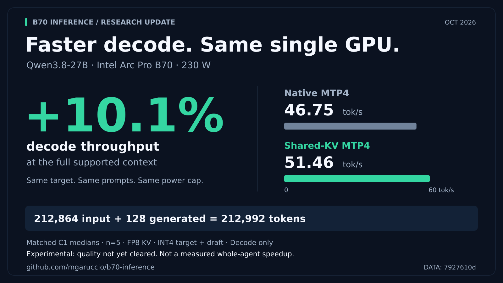
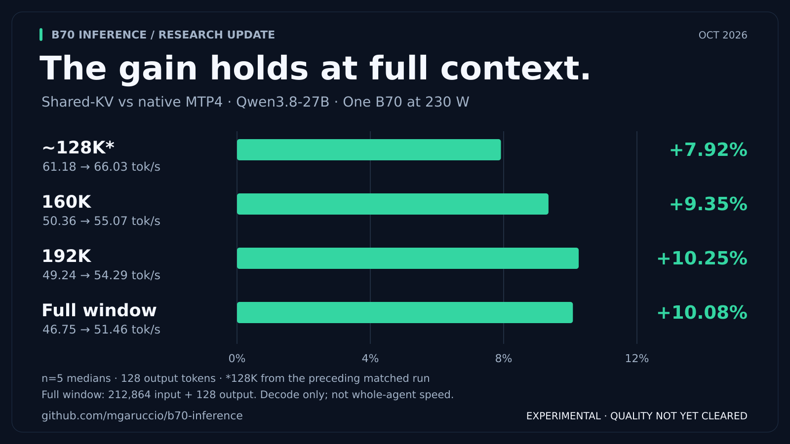

# Qwen3.8 on one B70: ~10% faster decode at long context

**October 2026 · experimental research update · single Intel Arc Pro B70, 230 W**

Our shared-KV MTP4 path reached **51.46 decode tok/s versus 46.75 for native
MTP4** at the full configured **212,992-token window**: a **10.08% increase in
median decode throughput**, on the same GPU, prompts and serving configuration.
The gain held at the limit rather than disappearing as the KV cache grew.



This is a useful long-context serving result, not a claim of 10% faster completed
agent tasks. **The optimized path remains experimental and is not promoted to
production; quality qualification is unresolved.**

## The result: small at short context, ~10% near the limit

Both local arms use native MTP4 with the same INT4 draft-side S+M1 configuration.
The candidate adds the shared-KV verification implementation; it is not being
compared against a slower BF16-draft baseline or someone else's machine.

| Input tokens | Native decode tok/s | Shared-KV decode tok/s | Change |
|---|---:|---:|---:|
| 512 | 115.42 | 115.38 | −0.04% |
| 8192 | 107.16 | 108.33 | +1.09% |
| 130944 (~128K) | 61.18 | 66.03 | +7.92% |
| 163840 (160K) | 50.36 | 55.07 | +9.35% |
| 196608 (192K) | 49.24 | 54.29 | +10.25% |
| 212864 (full window minus output) | 46.75 | 51.46 | +10.08% |

Five measured prompts per point, each generating 128 tokens. The last point is
**212864 input + 128 output = 212992 total tokens**. The first three rows come
from the preceding matched 230 W campaign; the last three extend that setup.
These are separate prompt cohorts, not one conversation grown continuously.



The observed benefit grows into long context and then levels off near 10%.
This is a descriptive trend from sequential native/candidate runs, not a
confidence interval or a claim that every prompt improves by that amount.

## Why this matters for agents

Long-running coding and research agents carry tool output, files and conversation
history in their context. **That history remains relevant to every subsequent
generated token.** Reducing decode cost with a large resident KV cache is useful
work even when the initial prompt was expensive to ingest.

A benchmark that ingests roughly 200K tokens once and emits only 128 tokens will
naturally spend almost all its wall time in prefill. That ratio describes this
cold-request workload; it does not measure the value of faster generation across
an ongoing session. The result here is the reduction in the generation-side cost
at large context, not an improvement to initial prompt ingestion.

We have **not** measured repeated agent turns, cache-reuse performance, task
completion times or agent success rates for this candidate. Those outcomes also
depend on prefill/reuse, generated-token counts, tool latency and model quality.
Agentic relevance is the motivation, not a substitute for an agent benchmark.

## What changed

MTP4 verification handles five query positions. The experimental implementation
groups those positions with the six query heads per KV head, aiming to reuse
K/V loads across the verification block instead of repeating that work. It uses
a per-position causal mask. The native path is unchanged in the baseline.

This is the existing build-06 custom operator, not a new model or draft setup:

- Library SHA256: `e0c6f2a78a1a50eef9dcc11b9c378c2e94799a3f5ffa0c8971849f03b3c1ddec`.
- [Implementation, operator tests and build provenance](../results/20261009-qwen38-native-shared-kv/).
- It is a shape-specific experimental integration, **not a drop-in kernel for
  arbitrary context, memory, batch or attention layouts**.
- Equal mathematical intent does not establish bitwise output or quality parity.

## Measurement and scope

- **Hardware:** one Intel Arc Pro B70, 32 GB; 230 W cap; same host/boot, CPU boost
  off and CPU frequency caps fixed in both arms.
- **Runtime:** vLLM XPU `0.27.2rc1.dev77+gac7509e2b`; pinned image and source hashes
  are recorded in the [campaign artifacts](../results/20261009-qwen38-community-protocol/).
- **Model:** Qwen3.8-27B GPTQ symmetric G128, FP16 target computation, FP8 KV;
  MTP4 with draft INT4 S+M1 and mixed-GDN-v5 in both arms.
- **Serving:** C1, context 212992, memory utilization .95, batch-token budget
  8192, thinking and prefix caching enabled. **Measured prefix-cache hits: zero.**
- **Inputs:** public cookbook exact-prompt generator and benchmark client, with
  the same retained prompts in both local arms. A one-line client compatibility
  change recognizes the server's streamed `reasoning` field.
- **Sampling:** temperature 0, EOS ignored, 128 output tokens; generic and
  same-shape full-output warmups excluded; five measured requests per point.
- **Metric:** `(completion_tokens - 1) / (request_end - first_generated)`.
  This is client post-first-generation **decode throughput**, not engine-only
  kernel latency, prefill throughput or whole-request throughput.

Both 230 W campaigns passed the FULL-graph execution-evidence checks. All 30
extension records were revalidated against raw SSE, including token counts,
prompt hashes, timing and reconstructed text. Both arms completed the full
context point 5/5. The card was restored to 275 W after testing, owned containers
were stopped, and the production launcher was not changed.

For completeness, at the full limit the post-first decode median fell from
2.717 to 2.468 seconds; TTFT was 452.989 versus 453.081 seconds. Total cold-request
medians were 455.763 versus 455.549 seconds. Each is a separately computed median.
These timings separate what improved from what was not optimized; they are not
an agent-session speedup estimate.

## Quality status: still a research result

An earlier full HumanEval+ evaluation scored **136/164 shared-KV versus 139/164
native**. Follow-up diagnostics found formatting failures and restart variability,
but did **not** establish quality neutrality or a fix. See the
[quality investigation](../results/20261009-qwen38-shared-kv-quality/).

In the new long-context speed run, streamed outputs matched on **11/15 paired
requests** (3/5, 5/5, 3/5 by increasing context). Draft acceptance also differed.
These are actual serving-throughput measurements, not an identical-work kernel
comparison or evidence that output differences are harmless.

This is a **development-tier research update**, not the repository's complete
standard-publication benchmark package, a community leaderboard claim, or a
production-ready release. The quality limitation is part of the result.

## Data, reproduction and share assets

The canonical [campaign report](../results/20261009-qwen38-community-protocol/README.md)
includes exact host commands, source pins, per-request dispersion and acceptance,
original failures, cleanup and checksums. In particular:

- [230 W comparison](../results/20261009-qwen38-community-protocol/comparison-230w.json)
- [160K/full-context comparison](../results/20261009-qwen38-community-protocol/comparison-long-230w.json)
- [Raw long-context archive](../results/20261009-qwen38-community-protocol/benchmark-long-230w.tar.gz)
- [Verifier](../results/20261009-qwen38-community-protocol/compare.py) and
  [long-context runner](../results/20261009-qwen38-community-protocol/run-long-context.py)

The runners preserve host-specific paths and deliberately refuse output reuse;
they are records of the experiment, not a one-command portable installer.

Two 1600×900 PNGs are ready to attach to a post:

- [Full-context result](images/qwen38-shared-kv-full-context.png) · [editable SVG](images/qwen38-shared-kv-full-context.svg)
- [Context/gain chart](images/qwen38-shared-kv-context-gains.png) · [editable SVG](images/qwen38-shared-kv-context-gains.svg)
- [Suggested Twitter copy and alt text](qwen38-shared-kv-social.md)

The graphics are rendered directly from the committed comparison JSON, not
AI-generated chart values. Regenerate with Python 3 and `rsvg-convert` installed:

```sh
python3 -B scripts/render-qwen38-social.py
```
